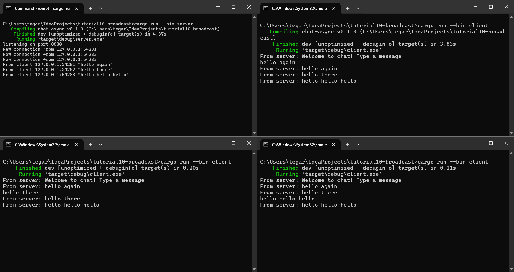

# Module 10 - Reflection
> Tegar Wahyu Khisbulloh (2206082032) - Pemrograman Lanjut A

## 2.1: Original code, and how it runs

**How to run:** <br>
Kita dapat menggunakan perintah `cargo run --bin server` untuk menjalankan server dan
`cargo run --bin client` untuk menjalankan client. 


**Example of use:** <br>
Seperti yang terlihat pada gambar di atas, kita dapat menjalankan server dan client secara 
bersamaan, yang mana semua client terhubung ke satu server yang sama. Ketika salah satu
client mengirimkan pesan, pesan tersebut akan diterima oleh server dan dikirimkan kembali
ke semua client yang terhubung.

## 2.2. Modifying the websocket port

Ketika kita ingin mengubah port websocket, kita dapat mengubah port yang digunakan pada
`server.rs` yakni pada:
```rust
async fn main() -> Result<(), Box<dyn Error + Send + Sync>> {
    ...
    let listener = TcpListener::bind("127.0.0.1:8080").await?;
    println!("listening on port 8080");
    ...
}
```
Kemudian kita juga perlu mengubah port yang digunakan pada `client.rs` yakni pada:
```rust
async fn main() -> Result<(), tokio_websockets::Error> {
    let (mut ws_stream, _) =
        ClientBuilder::from_uri(Uri::from_static("ws://127.0.0.1:8080"))
            .connect()
            .await?;
    ...
}
```
Kedua file tersebut harus menggunakan websocket protocol yang sama, dalam hal ini adalah
`ws://`. Jika tidak menggunakan protocol yang sama, maka akan terjadi error dimana client tidak
dapat terhubung ke server.

Program akan berjalan seperti biasa dengan port yang telah diubah seperti pada gambar di bawah ini.
